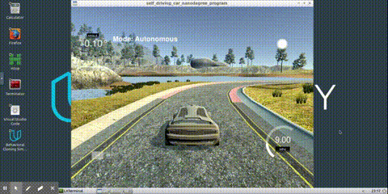
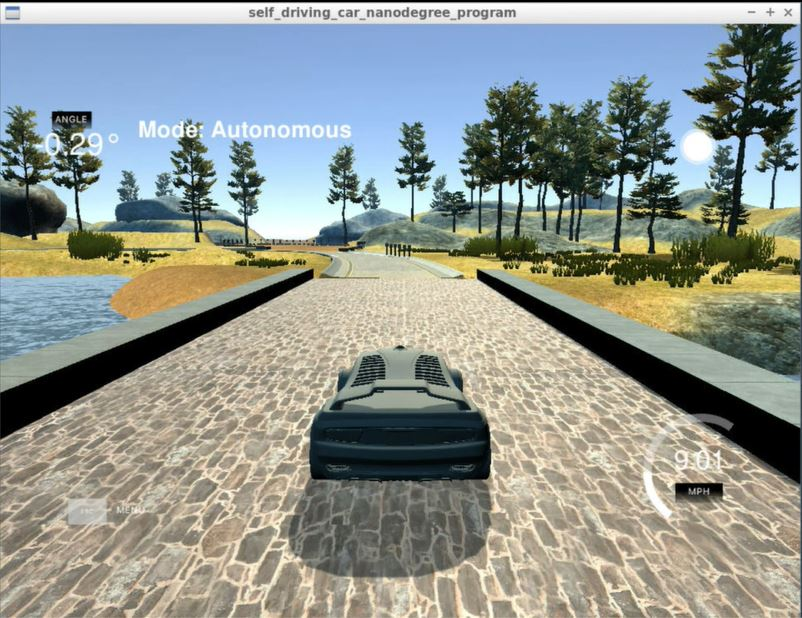

# **Udacity Self-Driving Car - Neural Networks Behavioral Cloning** 

**Neural Networks Behavioral Cloning Project**



The goals of this project:
* Use the Unity 3D simulator to collect data of good driving behavior
* Build a convolution neural network in Keras that predicts steering angles from images
* Train and validate the model with a training and validation set
* Test that the model successfully drives around track without leaving the road

[//]: # (Image References)
[hard]: readme_images/hard.jpg "Hard Scenario Image"

---

This project includes the following files:
* `model.py` containing the script to create and train the model
* `resume_training.py` containint the script to reopen the trained model and apply further training
* `drive.py` for driving the car in autonomous mode
* `model.h5` containing a trained convolution neural network 

Using the Unity 3D simulator and the drive.py file, the car can be driven autonomously around the track by executing 
```
python drive.py model.h5
```

`model.py` contains the code for training and saving the convolution neural network. The file shows the pipeline I used for training and validating the model, and it contains comments to explain how the code works.

## Getting Started

### Unity 3D Simulator

Please refer to this [repository](https://github.com/udacity/self-driving-car-sim) for self-driving car simulators. This project uses Term 1 simulator.

#### Download Links:

[Linux](https://d17h27t6h515a5.cloudfront.net/topher/2016/November/5831f0f7_simulator-linux/simulator-linux.zip)

[Mac](https://s3-us-west-1.amazonaws.com/udacity-selfdrivingcar/Term1-Sim/term1-simulator-mac.zip)

[Windows](https://s3-us-west-1.amazonaws.com/udacity-selfdrivingcar/Term1-Sim/term1-simulator-windows.zip)

#### Run the Simulator

Once the simulator application is opened, there are two modes for selection. **Traning Mode** is for collecting traning data, and **Autonomous Mode** is for driving autonomously by our trained neural network.

This project is about track 1. However, I will collect and train the model for track 2 as well in the future.

In the Traning Mode, there is a **RECORD** button on the top right corner of the screen. This is for capturing driving data. It will prompt for the location to store the traning and validation data. I recommend to choose a hard drive with more storage space and create a folder with a nicer name (e.g. CarTrainingData/). Then the simulator starts to record.

Keyboard Arrow Keys and WASD are configured to control the vehicle. However, I recomment to use mouse for more smooth and precise steering angle.

You can choose to capture 1 lap of driving data or 10 laps, depends on your objectives. However, I found that around 2 laps of data is enough to drive safely around the lake. I recommend to start with smaller training data to reduce training time. You can always come back and collect more data if your want better neural network performance.

Once you are satisfied with the data collection, you can press **RECORD** button again to stop record.




### Model Architecture and Training Strategy

#### 1. An appropriate model architecture has been employed


My model is based on Nvidia's CNN architecture for self-driving cars. Start from bottom to top, the network consists of a nomalization layer, 5 convolution layers, and 4 fully connected layers.

The top and bottom portions of the training image (i.e., the sky and the hood of the car) is cropped off for better training performance.

```python
"""
Neural Network
"""
model = Sequential()

# Normalize Data
model.add(Lambda(lambda x: (x / 255.0) - 0.5, input_shape=(160, 320, 3)))

# Crop off unused
model.add(Cropping2D(cropping=((70, 25), (0, 0))))

model.add(Convolution2D(24, 5, 5, subsample=(2, 2), activation="relu"))

model.add(Convolution2D(36, 5, 5, subsample=(2, 2), activation="relu"))

model.add(Convolution2D(48, 5, 5, subsample=(2, 2), activation="relu"))

model.add(Convolution2D(64, 3, 3, activation="relu"))
model.add(Convolution2D(64, 3, 3, activation="relu"))

model.add(Flatten())

# Dropout layer
model.add(Dropout(0.25, noise_shape=None, seed=None))

model.add(Dense(100))
model.add(Dense(50))
model.add(Dense(10))
model.add(Dense(1))
```

#### 2. Attempts to reduce overfitting in the model

From the code above, I implemented a dropout layer before the four fully connected layers in order to reduce overfitting. 

The model was tested by running it through the simulator and ensuring that the vehicle could stay on the track.

#### 3. Model parameter tuning

The model used an adam optimizer, so the learning rate was not tuned manually.

```python
model.compile(loss='mse', optimizer='adam')
```

#### 4. Appropriate training data

Training data was chosen to keep the vehicle driving on the road.

Udacity has given the training data for initial training. The training data is sufficient for training the car to stay relatively at the center of the road most of the times. However, when the turn becomes sharp, the car loses control and sometimes drives into the water.

The image below is an example of a difficult sharp curve.

![alt text][hard]

To improve performance, more data are collected by driving through the sharp corners. I have both scenarios of driving at the center of the road, and driving to the edge and "save" the car back to the center of the road for trainig data.

For details about how I created the training data, see the next section.

### Model Architecture and Training Strategy

#### 1. Solution Design Approach

The overall strategy for deriving a model architecture was to implementing the CNN developed by Nvidia, making adjustments and finetuning the model.

My first step was to use a convolution neural network model similar to the Nvidia's CNN.

In order to gauge how well the model was working, I split my image and steering angle data into a training and validation set, by a factor of 0.15. I found that my first model had a low mean squared error on the training set but a high mean squared error on the validation set. This implied that the model was overfitting. 

I implemented a dropout layer before the four fully connected layers. It helps to reduce the validation errors down to less than 0.01.

The final step was to run the simulator to see how well the car was driving around track one. There were a few spots where the vehicle fell off the track, for example the image above. I intentially drive through these difficult corners and collect training data. Then I feed the new training data to the pre-trained network.

At the end of the process, the vehicle is able to drive autonomously around the track without leaving the road.

#### 2. Creation of the Training Set & Training Process

To capture good driving behavior, I first used the sample training data provided by Udacity. It turned out that the car drives relative smooth on most of the places. However, when encountering sharp curves, the car lost control.

I then emphasized the curvy roads and made training data around that area. I drove back and forth for both directions. I kept the vehicle center of the road for good driving behavior, and also intentionally drive the car to the edge and "save" the car back to the center of the road. This helps the neural network learn how to deal with the time when "almost lose control".

Then I repeated this process on track two in order to get more data points.

To augment the data sat, I also flipped images and angles to add more training data.

The training is a stop and go process for many times. I train the network, save the model, and see how the car drives in autonomous mode. If the car loses control, I train more, and collect more data. Then I reload the old trained model, and feed more training images. Then I check how the training goes by watching the autonomous mode again. By iteraing the process, it saves the training time and passed the mission.
